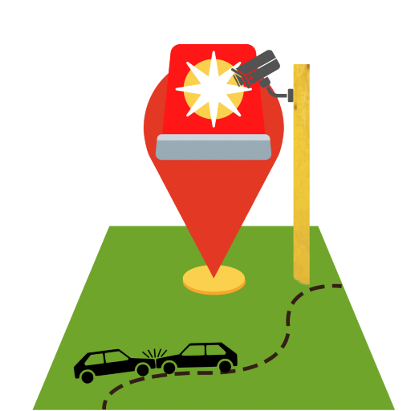

[![Contributors][contributors-shield]][contributors-url]
[![Forks][forks-shield]][forks-url]
[![Stargazers][stars-shield]][stars-url]
[![Issues][issues-shield]][issues-url]

 

   

  <h3 align="center">README-Template</h3>

  

    _Vois Summer Internship Project!
     
    <a href="https://github.com/Tesipog/Accident_detection/blob/master/Bro'grammers_Documentation.pdf"><strong>Explore the docs »</strong></a>
     
     
    <a href="https://drive.google.com/drive/folders/1caJCwRfQqGuswq8gAovkohPYyqH4rzaG">View Demo</a>
    ·
    <a href="https://github.com/Tesipog/Accident_detection/issue">Request Feature</a>
  

<h1>Accident Detection System</h1>

**The problem**

A significant number of people are ignored or forgotten following road accidents in order to avoid unwanted inquiries that may prove fatal to several people.
As a result of the delay in response time to these accidents, the ambulance or police department is delayed in arriving at the scene..
In these critical situations every second counts for life. There is not any concrete step to stop the loss of lives due to such road accidents.

**Solution to the Problem**

A Model that takes in CCTV camera footage and detects whether an accident has happened or not.
In case it detects an accident it sends alerts to the concerned authorities via flash message. These alerts have location link to the area where accident was detected
The purpose of the Road Accident Detection System is to provide citizens with accident alerts as they travel on the highway based on their location.
If an accident occurs, it also provides a help feature that will notify the concerned authorities.

**Technologies Used**

<a href="https://www.tensorflow.org/resources/learn-ml?gclid=Cj0KCQjwyOuYBhCGARIsAIdGQROOYU5jrpzqRgStnn_YorQUdZ4F_6fyQRzYC1DT-U9IwktiXBsh9M8aAqrnEALw_wcB">TensorFlow</a>

<a href="https://keras.io/">Keras</a>

<a href="https://pypi.org/project/opencv-python/">OpenCv</a>

<a href="https://matplotlib.org/">matplotlib</a>

<a href="https://www.twilio.com/">twilio</a>

<a href="https://numpy.org/">numpy</a>

<a href="https://ipython.readthedocs.io/en/stable/api/generated/IPython.display.html">Ipython.display</a>

**Prerequisites**

To use this project Python Version > 3.6 is recommended
To contribute to this project, knowledge of basic python scripting, Machine Learning, and Deep Learning will help

**WorkFlow**

For the final dataset, we used pictures of accidents involving cars, buses, bikes, etc. that were captured by CCTV cameras placed at street corners. To keep classes balanced, we took an equal amount of negative cases (without an accident).
Each video is divided into its constituent frames for independent analysis. Each of these images is composed of a two-dimensional array of pixels, each of which contains information on the RGB colour values. We transform the 3-D RGB colour arrays into grayscale in order to decrease the dimensionality at the individual image level. Additionally, we resize each image to (144, 256) in order to simplify computations on a CPU and effectively reduce the size of each image to a 1-D array.

**The Algorithm**

Using a Convolutional Neural network method, the challenging task of categorising video material is taken on. Each video consists of a collection of discrete, chronologically ordered images.

**Convolution**

Convolution is a specialized type of linear operation used for feature extraction, where a small array of numbers, called a kernel, is applied across the input, which is an array of numbers, called a tensor. An element-wise product between each element of the kernel and the input tensor is calculated at each location of the tensor and summed to obtain the output value in the corresponding position of the output tensor, called a feature map

**Max Pooling**

The most popular form of pooling operation is max pooling, which extracts patches from the input feature maps, outputs the maximum value in each patch, and discards all the other values . A max pooling with a filter of size 2 × 2 with a stride of 2 is commonly used in practice

**Flattening**

It is converting the data into a 1-dimensional array for inputting it to the next layer. We flatten the output of the convolutional layers to create a single long feature vector. And it is connected to the final classification model, which is called a fully-connected layer.

**Twilio**

Twilio is a custBy creating an account twilio official Website We have used our SID,Auth token to create a Client and used our twilio number to send Require messages.omer engagement platform used by hundreds of thousands of businesses and more than ten million developers worldwide to build unique, personalized experiences for their customers
By creating an account twilio official Website We have used our SID,Auth token to create a Client and used our twilio number to send Require messages.

**Contributing**

Pull requests are welcome. For major changes, please open an issue first to discuss what you would like to change. Please make sure to update tests as appropriate.

**The Team**

<a href="https://github.com/Tesipog">KrishnaSai Gopisetty</a>

<a href="https://github.com/Iamchandra-3">Chandra sekhar Vinnakota</a>

<a href="https://github.com/sricharan-thumma">Sricharan Thumma</a>

<a href="https://github.com/hemanth-bavirisetty">Hemanth Bavirisetty</a>

<a href="https://github.com/hariprasadchintham">Hariprasad Chintham</a>

[contributors-shield]: https://img.shields.io/github/contributors/Tesipog/Accident_detection
[contributors-url]: https://github.com/Tesipog/Accident_detection/graphs/contributors
[forks-shield]: https://img.shields.io/github/forks/Tesipog/Accident_detection
[forks-url]: https://github.com/Tesipog/Accident_detection/network/members
[stars-shield]: https://img.shields.io/github/stars/Tesipog/Accident_detection
[stars-url]: https://github.com/Tesipog/Accident_detection/stargazers
[issues-shield]: https://img.shields.io/github/issues/Tesipog/Accident_detection
[issues-url]: https://github.com/Tesipog/Accident_detection/issues
